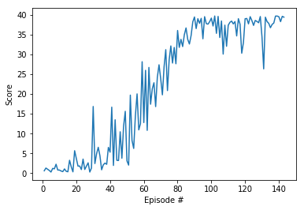

# Implementation
----------------------------------------------------------------------------------------------------------------------
## Learning Algorithm
The Deep Deterministic Policy Gradient (DDPG) Algorithm detailed in [this research paper](https://arxiv.org/pdf/1509.02971.pdf) is used. The algorithm can be outlined as follows:
- Randomly initialize critic network and actor.
- Initialize target network.
- Initialize replay buffer `R`.
- **for** episode = 1 to `M` **do**:
    - Initialize a random process for action exploration.
    - Receive initial observation states.
    - **for** t = 1 to `T` **do**:
        - Select action according to the current policy and exploration noise.
        - Execute action and observe reward and observe new state.
        - Store transition `R`.
        - Sample a random minibatch of `N` transitions from `R`.
        - Update critic by minimizing the loss.
        - Update the actor policy using the sampled policy gradient.
        - Update the target networks.
        
    **end for** 
    
  **end for**
  
## Hyperparameters
I started with the hyperparameters from the previous lesson, which were not very effective. Then I increased the batch size and decreased the discount factor, but that only made a slight difference. What really helped stabilize the training was: first, training on the whole episode at a time and removing the limit on time steps (which makes sense because it makes the agent learn more effectively about the entire episode), and, second, minimizing the standard diviation (sigma) of the OU Noise. 

### Agent Hyperparameters
```
BUFFER_SIZE = int(1e6) # replay buffer size
BATCH_SIZE = 256       # minibatch size
GAMMA = 0.9            # discount factor
TAU = 1e-3             # for soft update of target parameters
LR_ACTOR = 1e-3        # learning rate of the actor
LR_CRITIC = 1e-3       # learning rate of the critic
WEIGHT_DECAY = 0.0     # L2 weight decay
```

### Ornstein-Uhlenbeck Noise Hyperparameters
```
mu = 0.0
theta = 0.15
sigma=0.01
```

## Model Architecture
The Actor Network Class has only one fully-connected hidden layer, which I found to be more consistent than deeper architectures.

The Critic Network Class is deeper. It has three hidden fully-connected layers, each followed by a leaky-relu activation layer. I did not experiment much with it, since I found no need at that point. But it definitely would be a place for more exploration in the future. However, I found that using gradient clipping to update the network made a huge difference in the stability of the reward increase.

## Scores vs Episodes
### Reward Plot


### Total Number of Episodes
```
Episode 100	Average Score: 15.43
Episode 143	Average Score: 30.12
 Environment solved in 43 episodes!	Average Score: 30.12
```

## Ideas for Future Work

Some more challenges to try would be to:
- Add batch normalization to stabilize the training even more.
- Experiment with the noise hyperparameters some more.
- Even though I got good results considering I'm using only one agent, I think the DDPG algorithm is very unstable when it comes to hyperparameters. It needs optimum values to give good results. So, I would try implementing other algorithms using the same environment, such as [PPO](https://arxiv.org/pdf/1707.06347.pdf), [A3C](https://arxiv.org/pdf/1602.01783.pdf), and [D4PG](https://openreview.net/pdf?id=SyZipzbCb).
